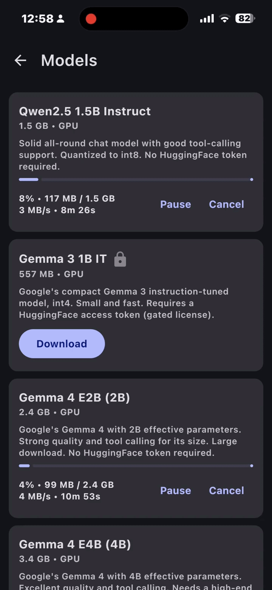
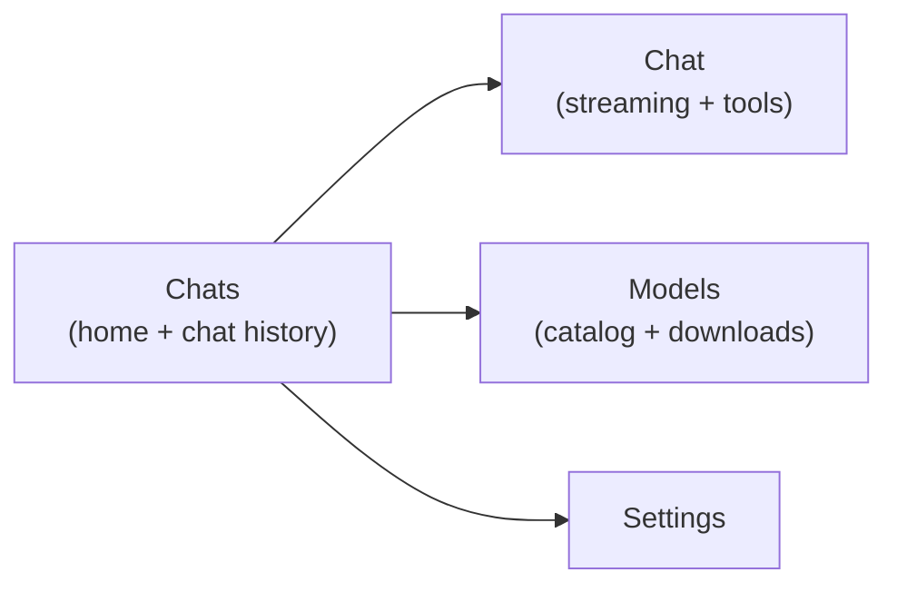
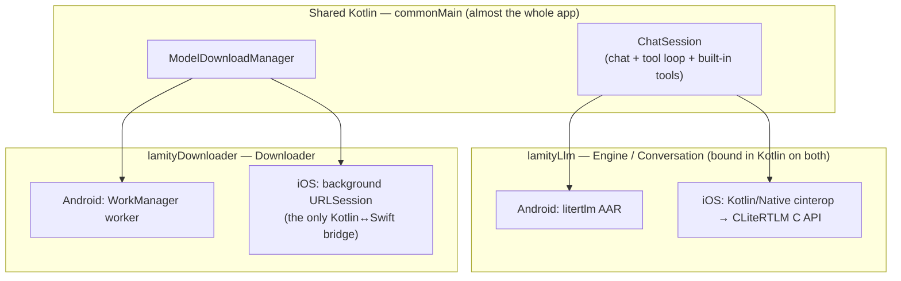
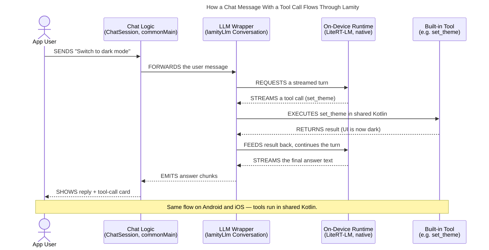

# Lamity

**An open-source reference implementation for integrating an on-device LLM into a
Kotlin Multiplatform app — the proper way.**

Lamity is a complete, production-shaped Android + iOS chat app whose inference runs
**fully on-device** through [Google LiteRT-LM](https://developers.google.com/edge/litert-lm/),
with all UI and business logic shared via Compose Multiplatform. It is published as a
learning resource: a worked example you can read, copy, and adapt — not a product.

Licensed under the [MIT License](LICENSE).

|               |                                                                          |
|---------------|--------------------------------------------------------------------------|
| **Platforms** | Android (Kotlin/JVM) · iOS (Kotlin/Native)                               |
| **UI**        | Compose Multiplatform (100% shared)                                      |
| **Inference** | LiteRT-LM `0.13.1`, fully on-device — no server, no network at chat time |
| **Language**  | Kotlin `2.4.0`                                                           |

---

## See it in action

On-device streaming chat with live tool calls, and multi-gigabyte model downloads
that keep running in the background — both driven entirely by shared Kotlin.

<div align="center">
  <table>
    <tr>
      <th>On-device chat &amp; tool calls</th>
      <th>Background model downloads</th>
    </tr>
    <tr>
      <td></td>
      <td></td>
    </tr>
  </table>
</div>

---

## What "the proper way" looks like here

Each decision below is demonstrated end-to-end in the codebase — these are the parts worth copying.

| Decision | How Lamity does it |
|----------|--------------------|
| **One idiomatic Kotlin API over the native runtime** | [`lamityLlm`](lamityLlm/) wraps LiteRT-LM behind coroutines and `Flow` — no native callbacks, no platform types leak to callers. The *same* `commonMain` code drives Android (the `litertlm` AAR) and iOS (Kotlin/Native cinterop straight to the CLiteRTLM C API). **This module is the heart of the project — [start with its README](lamityLlm/README.md).** |
| **Chat logic lives in common Kotlin** | The multi-turn tool-calling loop, message merging, and JSON wire format are platform-agnostic. The native runtimes only hand back one streamed turn at a time; they never run tools. So a `set_theme` call changes the UI the same way on both OSes. |
| **Streaming with real cancellation** | Generation is a cold `Flow`; cancelling the collecting coroutine tears down the native turn through structured concurrency. |
| **Downloads survive app death** | Multi-gigabyte model files transfer via WorkManager (Android) and a background `URLSession` (iOS) — with pause/resume, live speed/ETA, optional SHA-256 check, and a Wi-Fi-only switch. See [`lamityDownloader`](lamityDownloader/README.md). |
| **Strict module boundaries** | A `data / domain / presentation` split per feature, wired with Koin, persisted with Room KMP, logged through one Kermit facade, reported through one crash-reporter facade. |

---

## What it does

A focused chat app — four screens with simple stack navigation:



### Features

| Feature | What you get |
|---------|--------------|
| **On-device chat** | Streaming replies, stop-generation, per-message speed (≈ tok/s), a thinking panel for reasoning models, and inline tool-call cards. Resumed chats are replayed natively via LiteRT-LM `initialMessages`. |
| **Background downloads** | Survive app death; pause/resume (HTTP Range / resume data), live speed + ETA, optional SHA-256 check, Android progress notification, Wi-Fi-only switch, and Hugging Face token support for gated models (the token is only sent to trusted hosts, never to redirect targets). |
| **Built-in tools** | Six tools, toggled per chat — see the table below. |
| **Built-in skills** | Claude-style progressive disclosure: the system prompt lists only name + description; the model pulls the full instructions through the implicit `load_skill` tool. Ships *Haiku Mode* and *Step-by-step Math*, toggled per chat. |
| **Per-chat customization** | Inference parameters (backend, max tokens, top-K, top-P, temperature), an optional system prompt, and tool/skill toggles — held in memory for that chat. |
| **Conversation history** | Room-persisted on-device; resume, rename, delete. |
| **Live i18n & theming** | English / Tiếng Việt / Español and light/dark/system, switchable live (including by the model via `set_language` / `set_theme`). |
| **Crash reporting** | Sentry KMP behind a `CrashReporter` facade; Kermit logs become breadcrumbs. A blank DSN fully disables it. |

### Model catalog

Curated `.litertlm` models from [litert-community](https://huggingface.co/litert-community):

| Model | Best for | Needs HF token? |
|-------|----------|:---:|
| **Qwen2.5 1.5B Instruct** | Solid all-rounder, good tool calling | No |
| **Gemma 3 1B IT** | Small & fast | Yes (gated) |
| **Gemma 4 E2B / E4B / 12B** | Higher quality, heavier on the device | — |
| **DeepSeek R1 Distill 1.5B** | Streams its reasoning before answering | No |

### Built-in tools

Each toggles on/off per chat:

| Tool | What it does |
|------|--------------|
| `get_current_time` | The current time, optionally for a given place |
| `calculate` | Evaluates a math expression |
| `set_theme` | Switches light/dark — live |
| `set_language` | Switches the UI language (en/vi/es) — live |
| `random_number` | Returns a random number |
| `device_info` | Reports basic device info |

---

## Architecture

### Modules

| Module | What it does |
|--------|--------------|
| `androidApp/` | Android entry point (Application, MainActivity, manifest) |
| `iosApp/` | Xcode project — SwiftUI entry + the background-download Swift bridge (`iosApp/Downloader/`) and the vendored `CLiteRTLM.xcframework` package (`iosApp/LiteRTLM/`, pinned to v0.13.1) |
| `shared/` | All app logic + Compose UI (also builds the iOS "Shared" framework) |
| `lamityLlm/` | Idiomatic KMP wrapper over LiteRT-LM — the integration reference ([README](lamityLlm/README.md)) |
| `lamityDownloader/` | Background file downloads: WorkManager / URLSession ([README](lamityDownloader/README.md)) |
| `lamityCrashReporter/` | Sentry KMP facade (`CrashReporter` + breadcrumb log writer) |
| `lamityLogger/` | Kermit re-export so every module logs the same way |

### Inside `shared`

Each feature keeps the same `data / domain / presentation` split. Cross-feature UI lives in
`core/presentation/designSystem`; screen-specific composables live in each feature's
`presentation/components/`.

```
com/phamtunglam/lamity/
  App.kt                 Compose root: theme + locale + Navigation 3 stack
  core/
    data/                Room KMP DB (db/: entities, daos, relations) + PreferenceDataStore + logging
    di/                  Koin modules (appModule + db + expect/actual platform)
    domain/platform/     AppDirs, PlatformInfo, time/ids (expect/actual)
    presentation/        designSystem/ (theme + reusable components) + navigation/ (Nav3 keys)
    LamityBuildConfig.kt App-level build config (e.g. crash-reporter DSN, default HF token)
  feature/
    chat/                data / domain (session factory + state) / presentation (+components/)
    history/             domain / presentation — the chats list, which is the app home
    models/              data / domain (catalog + download use cases) / presentation (+components/)
    settings/            data / domain / presentation
    localization/        data / domain / presentation — runtime en/vi/es switching
    skills/              domain — code-defined BuiltinSkills, per-chat toggles
    tools/               domain (built-in tools + Calculator) + di
```

### How the pieces talk

Almost everything is common code. The LLM runtime is bound **in Kotlin on both platforms**, so the
only remaining Kotlin↔Swift bridge is the iOS background downloader. Tool calls run in shared
Kotlin, so theme/language switches and tool-event chat cards behave identically on both OSes.



### A chat turn, end to end

This is the payoff of keeping the tool loop in common Kotlin: the same flow runs on both platforms.



---

## Why `lamityLlm` isn't a separate library

`lamityLlm` is the part most people will want to lift into their own project, and it's built to
make that easy: self-contained, depends only on coroutines and serialization, and ships its own
[library-grade README](lamityLlm/README.md) with a full API reference.

It is **deliberately not published as a standalone artifact or repo.** A separate library means an
ongoing commitment — releases, versioning, keeping the vendored CLiteRTLM headers in sync — that
this project won't take on. Keeping it in-tree also fits the reference goal: you can read the whole
integration (download → persist → chat → native runtime) in one place, then copy the module
wholesale when you want it. Treat it as reference source to adapt.

---

## Build & run

### Configuration (local secrets)

Both secrets are **optional** — leave them blank and the app still runs. Neither file is committed;
the values are read at build time and surfaced to shared code via `LamityBuildConfig`.

| Secret | What it unlocks | If left blank |
|--------|-----------------|---------------|
| `HF_TOKEN` | Downloads of gated models (e.g. *Gemma 3 1B IT*). Use a read-scope [Hugging Face token](https://huggingface.co/settings/tokens). | Authenticated downloads off; un-gated models still work. |
| `SENTRY_DSN` | Crash reporting. | Crash reporting off. |

Where to put them:

- **Android** — copy [`local.properties.example`](local.properties.example) to `local.properties`.
- **iOS** — copy [`iosApp/Configuration/BuildConfig.xcconfig.example`](iosApp/Configuration/BuildConfig.xcconfig.example)
  to `BuildConfig.xcconfig` (note the `$()` trick in the file that keeps the DSN's `//` from being
  read as a comment).

### Android

```bash
./gradlew :androidApp:assembleDebug      # or installDebug with a device attached
```

Requires JDK 17+ (Android Studio's bundled JBR works). With sdkman, point `JAVA_HOME` at a
JDK explicitly:

```bash
JAVA_HOME=~/.sdkman/candidates/java/21.0.6-tem ./gradlew :androidApp:assembleDebug
```

The manifest already declares the OpenCL native libraries the GPU backend needs and the
foreground-service type used by the download notification.

### iOS

1. `open iosApp/iosApp.xcodeproj`
2. Set your team in `iosApp/Configuration/Config.xcconfig` (`TEAM_ID=...`).
3. Xcode compiles the Kotlin `Shared` framework (a build phase) and resolves the **vendored
   local package** in `iosApp/LiteRTLM`, which pins and fetches the prebuilt
   `CLiteRTLM.xcframework` (v0.13.1) on first build. LiteRT-LM itself is consumed as a pure
   Kotlin/Native cinterop port in `lamityLlm` — there is no Swift wrapper; the package's
   only job is to vend the dynamic framework binary.
4. Run on a **physical device** for GPU (Metal) inference. On the simulator, prefer small
   models and set the model's backend to **CPU** (Chat → customize sheet, or Models).

### Tests & static analysis

A `Makefile` wraps the common Gradle invocations:

```bash
make test-all        # Android + iOS unit tests across every module
make test-android    # JVM/Android host tests only
make test-ios        # iOS simulator tests only
make test-llm        # one module, both platforms (also: test-shared, test-downloader, …)
make lint            # ktlint + Detekt
```

---

## Try it (first chat)

1. Launch the app → **Chats** (the home screen) → start a **new chat**.
2. Open **Models** and download *Qwen2.5 1.5B Instruct* (no token; good tool calling). Downloads continue in the background —
   pause/resume them freely.
3. For *Gemma 3 1B*: accept the license on HuggingFace, create a read-scope access token at
   `huggingface.co/settings/tokens`, set it as `HF_TOKEN` (see
   [Configuration](#configuration-local-secrets)), then rebuild and download.
4. Back in the chat, with the model selected, try:
    - "What time is it in Paris?" → `get_current_time`
    - "What is 12.5% of 2,348?" → `calculate`
    - "Switch the app to dark mode" / "Đổi ngôn ngữ sang tiếng Việt" → `set_theme` /
      `set_language` (the UI updates immediately)
    - Enable **Haiku Mode** in the chat's customize sheet, then "Why is the sky blue?" →
      `load_skill`
5. Open a chat's **customize sheet** to tweak inference parameters, set a system prompt, and
   toggle tools/skills for that conversation.

---

## Notes & known limits

- **Tool-calling quality depends on the model.** Qwen2.5 1.5B is the most reliable of the
  seeded set; DeepSeek R1 streams reasoning but does not do tool calls.
- **LiteRT-LM is pinned to `0.13.1` on both platforms** (`litertlm-android` on Maven; the
  vendored CLiteRTLM xcframework + cinterop `.def` on iOS). If you bump it, the Android AAR
  coordinate and the iOS cinterop headers are the integration points to touch — see
  [`lamityLlm/README.md`](lamityLlm/README.md).
- **Engine load can take ~5 s** for larger models on first run; later loads are faster
  thanks to the compilation cache directory.
- The "thinking" channel (`message.channels["thought"]`) is surfaced on both platforms.
- On iOS, a download with a HuggingFace token resolves the redirect chain up front (a
  background session follows redirects without consulting the app), so the token is never
  forwarded to the CDN.

---

## Acknowledgements

- [Google LiteRT-LM](https://developers.google.com/edge/litert-lm/android) — the on-device
  runtime (Apache-2.0). The iOS `CLiteRTLM.xcframework` is its official prebuilt binary.
- [litert-community](https://huggingface.co/litert-community) — the `.litertlm` model files.

## License

[MIT](LICENSE) © 2026 Pham Tung Lam. The bundled LiteRT-LM runtime and the catalog models
are distributed under their own licenses (Apache-2.0 and per-model terms, respectively).
