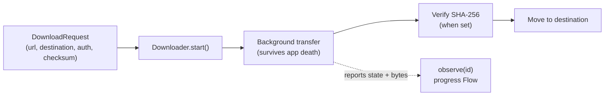
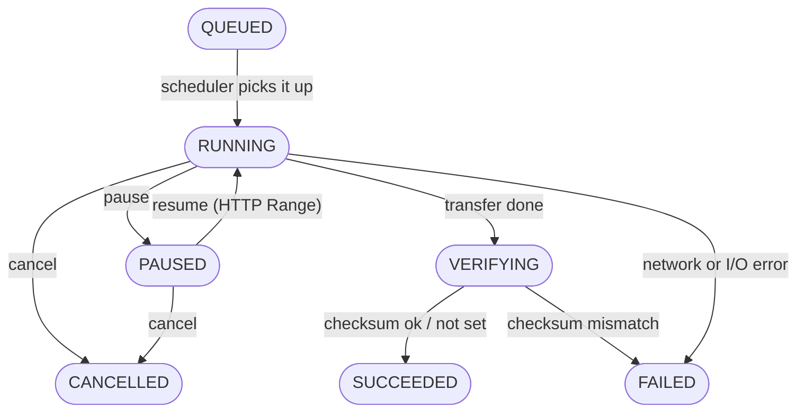
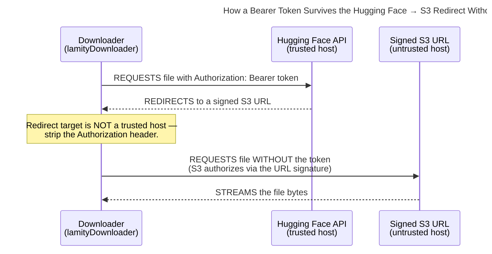
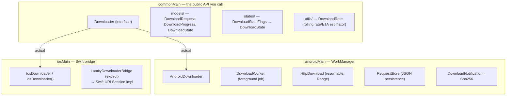

# lamityDownloader

A Kotlin Multiplatform (Android + iOS) **background file downloader**. It exposes a single
idiomatic Kotlin API — coroutines and `Flow` — over each platform's native background-transfer
engine, so downloads keep running while the app is backgrounded or killed, can be paused and
resumed, and are optionally verified against a SHA-256 checksum.

- **Android** runs each download as a unique [WorkManager](https://developer.android.com/topic/libraries/architecture/workmanager) job with a foreground progress notification.
- **iOS** delegates to a background `URLSession` through a thin Swift bridge.

The same `commonMain` code drives both. Consumers write to the common API and never touch
platform native types.

```kotlin
val downloader: Downloader = AndroidDownloader(context)   // or iosDownloader() on iOS

downloader.start(
    DownloadRequest(
        id = "gemma-3-1b",
        url = "https://example.com/model.litertlm",
        destinationPath = "/data/.../models/gemma-3-1b.litertlm",
        sha256 = "9f86d0818140...",
    ),
)

downloader.observe("gemma-3-1b").collect { progress ->
    println("${progress?.state} — ${progress?.downloadedBytes}/${progress?.totalBytes}")
}
```

---

## Table of contents

- [Requirements](#requirements)
- [Installation](#installation)
    - [Platform setup](#platform-setup)
- [Concepts at a glance](#concepts-at-a-glance)
- [Quick start](#quick-start)
- [API reference](#api-reference)
    - [Downloader](#downloader)
    - [Obtaining an instance](#obtaining-an-instance)
- [Models](#models)
    - [DownloadRequest](#downloadrequest)
    - [DownloadProgress](#downloadprogress)
    - [DownloadState](#downloadstate)
- [Lifecycle: pause, resume, cancel](#lifecycle-pause-resume-cancel)
- [Checksums & verification](#checksums--verification)
- [Authorization & trusted hosts](#authorization--trusted-hosts)
- [Error handling](#error-handling)
- [Threading & cancellation](#threading--cancellation)
- [Architecture](#architecture)
- [References](#references)

---

## Requirements

|                       | Version   |
|-----------------------|-----------|
| Kotlin                | `2.4.0`   |
| kotlinx.coroutines    | `1.10.2`  |
| kotlinx.serialization | `1.9.0`   |
| AndroidX WorkManager  | `2.11.2`  |
| Okio                  | `3.17.0`  |

**Targets:** `androidLibrary` (`com.android.kotlin.multiplatform.library`, `minSdk 28`,
`compileSdk 36`, JVM 11), `iosArm64`, `iosSimulatorArm64`.

---

## Installation

This is an internal module in the Lamity monorepo. Add it as a project dependency:

```kotlin
// build.gradle.kts of the consuming module
kotlin {
    sourceSets {
        commonMain.dependencies {
            implementation(projects.lamityDownloader)
        }
    }
}
```

The module pulls in `kotlinx-coroutines-core` and `kotlinx-serialization-json`; the Android source
set additionally binds `androidx.work:work-runtime` and Okio. It has no dependency on any other
Lamity module — it is a standalone library.

### Platform setup

**Android** — the download worker runs as a *foreground* WorkManager job, so the host app must
declare the relevant permissions and the `dataSync` foreground-service type in its
`AndroidManifest.xml`:

```xml
<uses-permission android:name="android.permission.INTERNET" />
<uses-permission android:name="android.permission.FOREGROUND_SERVICE" />
<uses-permission android:name="android.permission.FOREGROUND_SERVICE_DATA_SYNC" />
<uses-permission android:name="android.permission.POST_NOTIFICATIONS" />

<application ...>
    <!-- WorkManager's foreground service must declare the dataSync type on API 34+. -->
    <service
        android:name="androidx.work.impl.foreground.SystemForegroundService"
        android:foregroundServiceType="dataSync"
        tools:node="merge" />
</application>
```

`POST_NOTIFICATIONS` is a runtime permission on API 33+; request it at runtime if you want the
progress notification to be visible (the download itself still runs without it). The module
creates its own `"lamity_downloads"` notification channel.

**iOS** — the Kotlin side delegates to a Swift implementation of `LamityDownloaderBridge` (over a
background `URLSession`). The host app must install that bridge **once at startup**, before the
Compose entry point resolves a `Downloader`:

```swift
// e.g. in your App init / SceneDelegate
DownloaderBootstrap.install()
```

To let downloads finish while the app is suspended and have the system relaunch the app on
completion, forward background-session events from your `UIApplicationDelegate`:

```swift
func application(
    _ application: UIApplication,
    handleEventsForBackgroundURLSession identifier: String,
    completionHandler: @escaping () -> Void
) {
    DownloaderBackgroundSessionCompletionRegistry.shared.register(
        identifier: identifier,
        completionHandler: completionHandler,
    )
    DownloaderBootstrap.install()
}
```

The Swift bridge implementation lives in
[`iosApp/iosApp/Downloader/`](../iosApp/iosApp/Downloader/). It owns the transfer, resume data,
SHA-256 verification, and the final file move; Kotlin only maps state back into the common API.

---

## Concepts at a glance



`pause(id)` / `resume(id)` / `cancel(id)` act on a transfer in flight — see
[Lifecycle](#lifecycle-pause-resume-cancel).

- A **`DownloadRequest`** fully describes one download — source URL, destination path, optional
  auth, optional checksum. It is `@Serializable` and used as the unit of work.
- A **`Downloader`** is the single entry point: `start` / `pause` / `resume` / `cancel` keyed by
  the request `id`, plus `observe(id)` for a live `Flow` of progress.
- A **`DownloadProgress`** is a point-in-time snapshot: a [`DownloadState`](#downloadstate) plus
  byte counts, transfer rate, and ETA.
- Downloads are **durable**: the transfer writes to a temporary `<destination>.part` file and is
  only moved into place after (optional) verification. Partial bytes survive a pause (and process
  death) so a resume continues via an HTTP `Range` request instead of starting over.

---

## Quick start

```kotlin
import com.phamtunglam.lamity.downloader.Downloader
import com.phamtunglam.lamity.downloader.models.DownloadRequest
import com.phamtunglam.lamity.downloader.models.DownloadState

suspend fun download(downloader: Downloader, modelsDir: String) {
    val request = DownloadRequest(
        id = "gemma-3-1b",                                     // stable key for this download
        url = "https://huggingface.co/.../model.litertlm",
        destinationPath = "$modelsDir/gemma-3-1b.litertlm",
        displayName = "Gemma 3 1B",                            // shown in the notification
        expectedSizeBytes = 554_000_000,                       // progress total when server omits length
        sha256 = "9f86d081884c7d65...",                        // verified before the file is moved
        requireUnmetered = true,                               // Wi-Fi only
    )

    // 1. Kick off (or restart) the download.
    downloader.start(request)

    // 2. Observe progress until it reaches a terminal state.
    downloader.observe(request.id).collect { progress ->
        when (progress?.state) {
            DownloadState.RUNNING ->
                println("${progress.downloadedBytes}/${progress.totalBytes} @ ${progress.bytesPerSecond} B/s")
            DownloadState.SUCCEEDED -> println("done → ${request.destinationPath}")
            DownloadState.FAILED -> println("failed: ${progress.error}")
            else -> { /* QUEUED, PAUSED, VERIFYING, CANCELLED, or null */ }
        }
    }
}
```

The `observe` flow is **hot in effect** but cheap to collect — collectors can come and go while the
background transfer keeps reporting. It emits `null` while nothing is known about the id (never
started, or cancelled and cleaned up).

---

## API reference

### `Downloader`

The single common interface. All methods are keyed by the request `id`.

```kotlin
interface Downloader {
    suspend fun start(request: DownloadRequest)
    suspend fun pause(id: String)
    suspend fun resume(id: String)
    suspend fun cancel(id: String)
    fun observe(id: String): Flow<DownloadProgress?>
}
```

| Member            | Notes                                                                                                              |
|-------------------|--------------------------------------------------------------------------------------------------------------------|
| `start(request)`  | Starts (or restarts) the download, replacing any active one with the same `id`. Survives process death.            |
| `pause(id)`       | Stops the transfer but **keeps** partial bytes so `resume` can continue it.                                         |
| `resume(id)`      | Continues a paused download. Throws `DownloadException` when nothing is stored for `id`.                            |
| `cancel(id)`      | Stops the transfer and disposes partial bytes **and** stored request state.                                        |
| `observe(id)`     | A `Flow<DownloadProgress?>`; emits `null` while nothing is known about the id. Deduplicated (`distinctUntilChanged`).|

### Obtaining an instance

You normally get a `Downloader` from DI rather than constructing it directly (in this repo it is
registered as a Koin `single<Downloader>` per platform).

**Android** — construct with a `Context` (any context; it is reduced to the application context):

```kotlin
val downloader: Downloader = AndroidDownloader(context)
```

**iOS** — use the factory, which resolves the Swift bridge installed at startup:

```kotlin
val downloader: Downloader = iosDownloader()
```

> `iosDownloader()` throws if `DownloaderBootstrap.install()` (Swift) has not run yet — see
> [Platform setup](#platform-setup).

---

## Models

All model types live in `com.phamtunglam.lamity.downloader.models`.

### `DownloadRequest`

```kotlin
@Serializable
data class DownloadRequest(
    val id: String,                                   // stable key: pause/resume/cancel/observe
    val url: String,                                  // source HTTP(S) URL
    val destinationPath: String,                      // final absolute path
    val displayName: String = id,                     // shown in platform notifications
    val headers: Map<String, String> = emptyMap(),    // extra request headers
    val bearerToken: String? = null,                  // Authorization: Bearer … (trusted hosts only)
    val trustedAuthHosts: Set<String> = emptySet(),   // host suffixes allowed to see the token
    val expectedSizeBytes: Long = 0,                  // progress total when server omits length; 0 = unknown
    val sha256: String? = null,                       // expected hex digest (any case); verified when set
    val requireUnmetered: Boolean = false,            // Wi-Fi only (Android also waits for it)
)
```

| Property            | Notes                                                                                                                                   |
|---------------------|-----------------------------------------------------------------------------------------------------------------------------------------|
| `destinationPath`   | The transfer writes to a temporary `<destinationPath>.part` sibling and moves it here only after (optional) verification.                |
| `expectedSizeBytes` | Used for the progress total when the server does not report a length. **Advisory only** — a size mismatch is logged, not treated as fatal.|
| `sha256`            | When set, the file is hashed and compared before being moved into place; a mismatch fails the download and deletes the partial file.     |
| `bearerToken` / `trustedAuthHosts` | See [Authorization & trusted hosts](#authorization--trusted-hosts).                                                       |
| `requireUnmetered`  | On Android the job's network constraint becomes `UNMETERED` (it waits for Wi-Fi); on iOS the request sets `allowsCellularAccess = false`. |

### `DownloadProgress`

```kotlin
data class DownloadProgress(
    val id: String,
    val state: DownloadState,
    val downloadedBytes: Long = 0,
    val totalBytes: Long = 0,        // 0 when unknown
    val bytesPerSecond: Long = 0,    // 0 until enough samples exist
    val etaMillis: Long = 0,         // 0 until enough samples exist
    val error: String? = null,       // set in the FAILED state
)
```

`bytesPerSecond` and `etaMillis` come from a rolling estimator over the last few progress ticks, so
they smooth out the bursty byte counts a network read loop produces.

### `DownloadState`

```kotlin
enum class DownloadState {
    QUEUED, RUNNING, PAUSED, VERIFYING, SUCCEEDED, FAILED, CANCELLED
}
```

| State | Meaning | Terminal? |
|-------|---------|:---:|
| `QUEUED` | Waiting for the scheduler (or a network matching the constraints) | — |
| `RUNNING` | Actively transferring bytes | — |
| `PAUSED` | Stopped, resumable bytes retained | — |
| `VERIFYING` | Transfer finished; verifying the SHA-256 checksum | — |
| `SUCCEEDED` | Finished; the file is at its destination path | ✓ |
| `FAILED` | Finished with an error (see `DownloadProgress.error`) | ✓ |
| `CANCELLED` | Stopped and disposed | ✓ |

A cancelled-or-finished work item that left partial bytes behind is reported as `PAUSED` so the UI
can offer a resume. See the [lifecycle state machine](#lifecycle-pause-resume-cancel) for how states
transition.

---

## Lifecycle: pause, resume, cancel

A download moves through these states (`SUCCEEDED` / `FAILED` / `CANCELLED` are terminal):



```kotlin
downloader.start(request)        // QUEUED → RUNNING → VERIFYING → SUCCEEDED
downloader.pause(request.id)     // RUNNING → PAUSED  (partial .part file retained)
downloader.resume(request.id)    // PAUSED  → RUNNING (continues via HTTP Range)
downloader.cancel(request.id)    // → CANCELLED, partial bytes + stored state deleted
```

- **Pause** stops the active transfer but keeps the `<destination>.part` file. The next `resume`
  (or `start` with the same id) sends an HTTP `Range: bytes=N-` request and appends to it when the
  server supports partial content; otherwise it restarts from zero.
- **Resume** rebuilds the request from persisted state, so it works even after the app has been
  killed and relaunched. It throws `DownloadException` if no request is stored for the id.
- **Cancel** deletes the partial file and the stored request — there is nothing left to resume.

On Android the full `DownloadRequest` is persisted as JSON by an internal `RequestStore` (because
WorkManager's `Data` has a ~10 KB cap), which is what makes resume-after-process-death possible. On
iOS the background `URLSession` retains the equivalent state.

---

## Checksums & verification

Set `DownloadRequest.sha256` to a hex digest (any case). After the bytes finish transferring, the
file enters the `VERIFYING` state, is streamed through a SHA-256 hash, and:

- **match** → atomically moved to `destinationPath`, state becomes `SUCCEEDED`.
- **mismatch** → the partial file is deleted and the download `FAILED`s with a
  `"Checksum mismatch — the downloaded file is corrupt."` error.

If `sha256` is `null`, verification is skipped and the file is moved into place as soon as the
transfer completes. `expectedSizeBytes`, in contrast, is only advisory: a size mismatch is logged
but does not fail the download.

---

## Authorization & trusted hosts

`bearerToken` is sent as an `Authorization: Bearer …` header — but **only to trusted hosts**:

- `trustedAuthHosts` is a set of host suffixes allowed to receive the token (a host matches an
  entry `h` when it equals `h` or ends with `.h`).
- When `trustedAuthHosts` is empty, only the host of `url` itself is trusted.
- Redirects are followed manually, and the `Authorization` header is **stripped** when a redirect
  points at an untrusted host.

This matters for signed-URL flows (e.g. Hugging Face → S3): the initial request to the API host
carries the token, but the redirect to the signed S3 URL must *not* — S3 rejects requests that
still carry an `Authorization` header alongside the URL signature.



```kotlin
DownloadRequest(
    id = "model",
    url = "https://huggingface.co/.../resolve/main/model.litertlm",
    destinationPath = "...",
    bearerToken = "hf_xxx",
    trustedAuthHosts = setOf("huggingface.co"),   // token never leaks to the S3 redirect target
)
```

---

## Error handling

Common failures surface as a single exception type:

```kotlin
class DownloadException(message: String, cause: Throwable? = null) : Exception(message, cause)
```

- `resume(id)` throws `DownloadException` synchronously when nothing is stored for the id.
- Transfer-time failures (HTTP errors, checksum mismatch, I/O errors, the move failing) are
  reported through the `observe` flow as a `FAILED` `DownloadProgress` with a populated `error`
  message — they are **not** thrown from `start`.

```kotlin
downloader.observe(id).collect { progress ->
    if (progress?.state == DownloadState.FAILED) {
        showError(progress.error ?: "Download failed.")
    }
}
```

A `401`/`403` failure is annotated with a hint that the resource may require a valid access token.

---

## Threading & cancellation

- `start` / `pause` / `resume` / `cancel` are `suspend` functions; the heavy work happens on the
  platform scheduler (WorkManager / background `URLSession`), not on the calling coroutine, so they
  are safe to call from any dispatcher, including the main one.
- `observe(id)` returns a cold `Flow`; on Android it is mapped off `Dispatchers.IO` and
  deduplicated. Collecting it never starts or stops a download — it only reports state.
- The background transfer continues regardless of whether anything is collecting `observe`, and
  survives the app being backgrounded or killed.

---

## Architecture



Key points:

- **Common owns the contract and the shared logic** — the `Downloader` interface, the model types,
  the `DownloadStateFlags → DownloadState` mapping, and the rolling `DownloadRate` estimator all
  live in `commonMain`.
- **Android** maps each download to a unique WorkManager job. `HttpDownload` does the resumable
  transfer with manual redirect handling, `RequestStore` persists the request as JSON for
  resume-after-death, `Sha256` verifies via Okio's `HashingSource`, and `DownloadNotification`
  drives the foreground progress notification.
- **iOS** is intentionally thin on the Kotlin side: an `expect`/`actual` `LamityDownloaderBridge`
  is implemented in Swift over a background `URLSession` (transfer, resume data, SHA-256, file
  move). `IosDownloader` keeps a long-lived observer per id feeding an in-memory progress map, so
  `observe` flows are cheap to (re)collect.

The `http/`, `workmanager/`, `persistence/`, `notifications/`, `checksums/`, `states/`, and
`bridge/` packages are `internal`. The public API is everything in
`com.phamtunglam.lamity.downloader` and `…downloader.models`.

---

## References

- [WorkManager](https://developer.android.com/topic/libraries/architecture/workmanager) — Android background-work scheduler
- [Downloading files in the background (URLSession)](https://developer.apple.com/documentation/foundation/url_loading_system/downloading_files_in_the_background) — iOS background transfers
- [Okio](https://square.github.io/okio/) — the I/O / filesystem / hashing library used on Android
