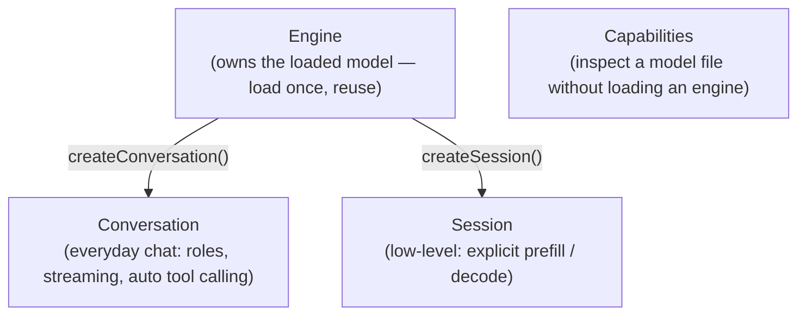
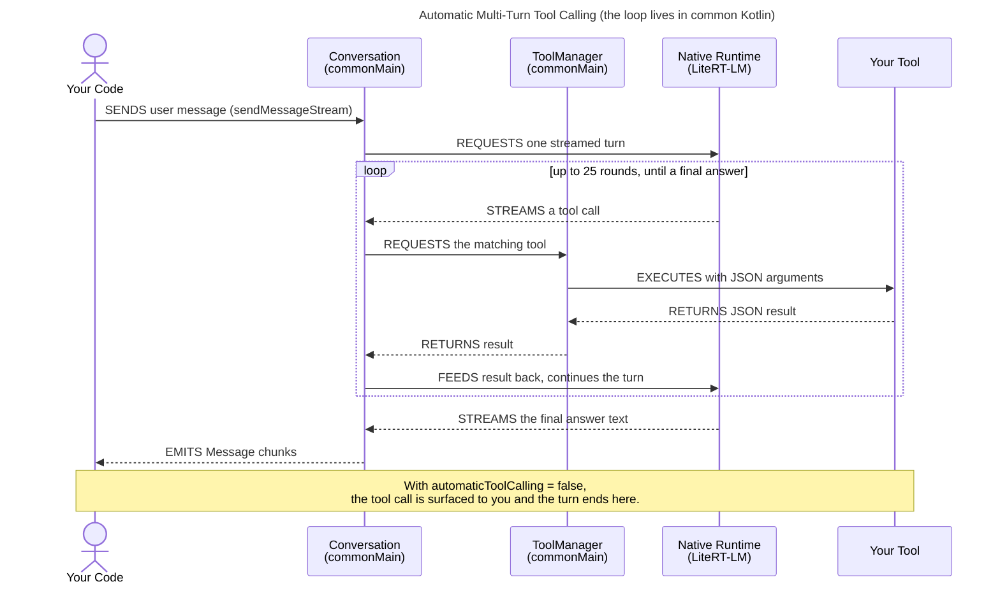
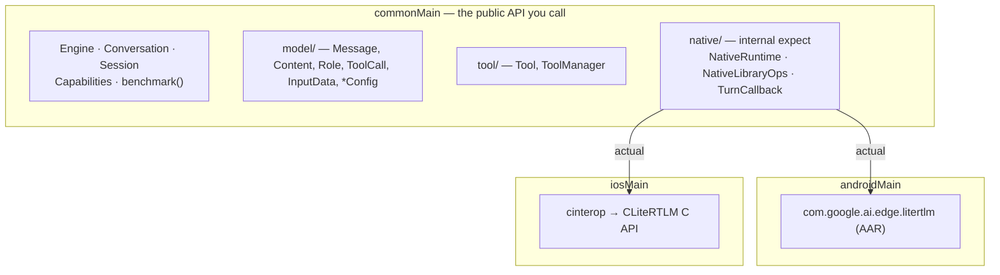

# lamityLlm

A Kotlin Multiplatform (Android + iOS) wrapper around **[LiteRT-LM](https://developers.google.com/edge/litert-lm/android)**, Google AI Edge's on-device LLM runtime.
It exposes a single idiomatic Kotlin API — coroutines and `Flow` instead of native callbacks, while running natively on both platforms.

- **Android** binds the `com.google.ai.edge.litertlm` AAR.
- **iOS** binds the CLiteRTLM C API directly via Kotlin/Native cinterop.

The same `commonMain` code drives both. Consumers write to the common API and never touch platform
native types.

```kotlin
val engine = Engine(EngineConfig(modelPath = "/path/to/model.litertlm"))
engine.initialize()

val conversation = engine.createConversation()
conversation.sendMessageStream(Message.user("Explain on-device inference in one sentence."))
    .collect { chunk -> print(chunk.text) }

conversation.dispose()
engine.dispose()
```

---

## Table of contents

- [Requirements](#requirements)
- [Installation](#installation)
- [Concepts at a glance](#concepts-at-a-glance)
- [Quick start](#quick-start)
- [API reference](#api-reference)
    - [Engine](#engine)
    - [Conversation](#conversation)
    - [Session (low-level)](#session-low-level)
    - [Capabilities](#capabilities)
    - [Top-level functions](#top-level-functions)
- [Configuration](#configuration)
- [Messages & content](#messages--content)
- [Tools (function calling)](#tools-function-calling)
- [Multimodal input](#multimodal-input)
- [Error handling](#error-handling)
- [Threading & cancellation](#threading--cancellation)
- [Architecture](#architecture)
- [References](#references)

---

## Requirements

|                       | Version                                                 |
|-----------------------|---------------------------------------------------------|
| LiteRT-LM             | `0.13.1` (Android AAR + vendored iOS CLiteRTLM headers) |
| Kotlin                | `2.4.0`                                                 |
| kotlinx.coroutines    | `1.10.2`                                                |
| kotlinx.serialization | `1.9.0`                                                 |

**Targets:** `androidLibrary` (`com.android.kotlin.multiplatform.library`), `iosArm64`,
`iosSimulatorArm64`.

A model file in the `.litertlm` format is required at runtime — e.g. one of the
[litert-community](https://huggingface.co/litert-community) models on Hugging Face. The module does
**not** download or manage models; pass it a path to a file already on disk.

---

## Installation

This is an internal module in the Lamity monorepo. Add it as a project dependency:

```kotlin
// build.gradle.kts of the consuming module
kotlin {
    sourceSets {
        commonMain.dependencies {
            implementation(projects.lamityLlm)
        }
    }
}
```

The module pulls in `kotlinx-coroutines-core` and `kotlinx-serialization-json` transitively; the
Android source set additionally binds `litertlm-android`. It has no dependency on any other Lamity
module (no logging coupling) — it is a standalone library.

### Platform setup

**Android** — no extra steps. The LiteRT-LM AAR ships the native libraries.

**iOS** — the Kotlin/Native cinterop only generates *bindings*; the `litert_lm_*` symbols are
resolved at app launch. The host app must:

1. Link the **LiteRTLM** Swift package (the native binary provider), force-loaded with `-all_load`.
2. Resolve the cinterop references late — the shared framework adds
   `linkerOpts("-undefined", "dynamic_lookup")` so `litert_lm_*` bind at app load.
3. Enable cinterop commonization so `iosMain` sees the bindings:
   ```properties
   # gradle.properties
   kotlin.mpp.enableCInteropCommonization=true
   ```

The vendored C headers live in
[`src/nativeInterop/cinterop/litertlm/`](src/nativeInterop/cinterop/litertlm/) and are kept in sync
with the `litertlm` version in `gradle/libs.versions.toml`.

---

## Concepts at a glance



| Object | What it is | Lifecycle |
|--------|------------|-----------|
| **`Engine`** | Owns the loaded model. Expensive to create — seconds, hundreds of MB. | Load one, reuse it; `dispose()` it **last**. |
| **`Conversation`** | The everyday chat surface: send a `Message`, stream `Message` chunks back, with multi-turn tool calling built in. | `dispose()` before the engine. |
| **`Session`** | Lower-level prefill/decode control, without the chat/role/tool layer. | `dispose()` before the engine. |
| **`Capabilities`** | Inspect a model file *without* loading a full engine (created from a path, not an engine). | `dispose()` when done. |

Every native-backed object holds a native handle and **must be `dispose()`d** when done.
`benchmark(config)` and `setMinimumLogLevel(...)` are [top-level utilities](#top-level-functions).

---

## Quick start

```kotlin
import com.phamtunglam.lamity.llm.Engine
import com.phamtunglam.lamity.llm.model.*

suspend fun chat(modelPath: String) {
    // 1. Load the model once.
    val engine = Engine(
        EngineConfig(
            modelPath = modelPath,
            backend = Backend.Gpu(),     // or Backend.Cpu(threadCount = 4)
            maxNumTokens = 4096,
        ),
    )
    engine.initialize()

    // 2. Open a conversation.
    val conversation = engine.createConversation(
        ConversationConfig(
            systemMessage = Message.system("You are a concise assistant."),
            samplerConfig = SamplerConfig(topK = 40, topP = 0.95, temperature = 0.8),
        ),
    )

    // 3. Stream a reply.
    conversation.sendMessageStream(Message.user("What is LiteRT-LM?"))
        .collect { chunk ->
            print(chunk.text)                                   // visible answer tokens
            chunk.channels["thought"]?.let { /* reasoning */ }  // model "thinking", if emitted
        }

    // 4. Clean up — order matters: conversations before the engine.
    conversation.dispose()
    engine.dispose()
}
```

---

## API reference

### `Engine`

Loads a model and spawns conversations or sessions from it.

```kotlin
class Engine(val engineConfig: EngineConfig) {
    val isInitialized: Boolean

    suspend fun initialize()
    suspend fun createConversation(config: ConversationConfig = ConversationConfig()): Conversation
    suspend fun createSession(config: SessionConfig = SessionConfig()): Session
    suspend fun dispose()
}
```

| Member                       | Notes                                                                                                              |
|------------------------------|--------------------------------------------------------------------------------------------------------------------|
| `initialize()`               | Loads the native engine off the main thread. Throws `LiteRtLmException` if already initialized. Heavy — call once. |
| `createConversation(config)` | Returns a ready `Conversation`. Throws if the engine is not initialized.                                           |
| `createSession(config)`      | Returns a lower-level `Session`. Throws if the engine is not initialized.                                          |
| `dispose()`                  | Releases the native engine. Idempotent (no-op if never initialized).                                               |

> **Lifecycle:** dispose every `Conversation`/`Session` you created from an engine *before*
> disposing the engine itself.

### `Conversation`

The high-level chat surface. Created via `Engine.createConversation`.

```kotlin
class Conversation {
    val isAlive: Boolean

    fun sendMessageStream(message: Message, extraContext: JsonObject? = null): Flow<Message>
    suspend fun sendMessage(message: Message, extraContext: JsonObject? = null): Message
    fun cancel()
    suspend fun getTokenCount(): Int
    suspend fun getBenchmarkInfo(): BenchmarkInfo
    suspend fun renderMessageIntoString(message: Message): String
    fun dispose()
}
```

| Member                             | Notes                                                                                                                                                                                                                                                                        |
|------------------------------------|------------------------------------------------------------------------------------------------------------------------------------------------------------------------------------------------------------------------------------------------------------------------------|
| `sendMessageStream(...)`           | Streams the response as a `Flow<Message>` of delta chunks. Each chunk may carry text, `channels` (e.g. `"thought"`), and/or tool calls. With automatic tool calling on, requested tools run and generation continues — up to **25** tool rounds — before the flow completes. |
| `sendMessage(...)`                 | Convenience wrapper that collects the stream and returns one merged `Message` (a `Role.Model` message with all text, channels and tool calls combined).                                                                                                                      |
| `cancel()`                         | Aborts the in-flight generation. Cancelling the collecting coroutine also cancels the native turn.                                                                                                                                                                           |
| `getTokenCount()`                  | Tokens currently in the conversation KV cache.                                                                                                                                                                                                                               |
| `getBenchmarkInfo()`               | Per-conversation benchmark stats (requires a benchmark-capable engine).                                                                                                                                                                                                      |
| `renderMessageIntoString(message)` | Renders a message through the model's prompt template — useful for debugging the exact prompt.                                                                                                                                                                               |
| `dispose()`                        | Releases the native conversation.                                                                                                                                                                                                                                            |

#### Streaming vs. one-shot

```kotlin
// Stream tokens as they arrive:
conversation.sendMessageStream(Message.user("Tell me a joke")).collect { chunk ->
    print(chunk.text)
}

// Or wait for the whole reply:
val reply: Message = conversation.sendMessage(Message.user("Tell me a joke"))
println(reply.text)
```

### `Session` (low-level)

For callers who want explicit prefill/decode control without the chat/role/tool layer. Created via
`Engine.createSession`. Input is a list of [`InputData`](#multimodal-input) rather than role-tagged
`Message`s.

```kotlin
class Session {
    val isAlive: Boolean

    suspend fun runPrefill(inputData: List<InputData>)
    suspend fun runDecode(): String
    suspend fun generateContent(inputData: List<InputData>): String
    fun generateContentStream(inputData: List<InputData>): Flow<String>
    fun cancelProcess()
    fun dispose()
}
```

| Member                             | Notes                                                                      |
|------------------------------------|----------------------------------------------------------------------------|
| `runPrefill(inputData)`            | Runs the prefill step over the inputs. Throws if `inputData` is empty.     |
| `runDecode()`                      | Runs decode and returns the generated text.                                |
| `generateContent(inputData)`       | Prefill + decode in one call; returns the full text.                       |
| `generateContentStream(inputData)` | Same, streaming text chunks as a `Flow<String>` (raw text, not `Message`). |
| `cancelProcess()`                  | Cancels ongoing processing.                                                |
| `dispose()`                        | Releases the native session.                                               |

```kotlin
val session = engine.createSession(SessionConfig(samplerConfig = SamplerConfig(40, 0.95, 0.8)))
session.generateContentStream(listOf(InputData.text("Summarize: ...")))
    .collect { print(it) }
session.dispose()
```

### `Capabilities`

Inspect a model file *without* loading a full engine.

```kotlin
class Capabilities(val modelPath: String) {
    val isAlive: Boolean
    fun hasSpeculativeDecodingSupport(): Boolean
    fun dispose()
}
```

```kotlin
val caps = Capabilities("/path/to/model.litertlm")
val canSpeculate = caps.hasSpeculativeDecodingSupport()
caps.dispose()
```

### Top-level functions

```kotlin
// Set the native LiteRT-LM library's minimum log level.
fun setMinimumLogLevel(severity: LogSeverity)

// Benchmark a model end-to-end. Heavy (loads the model); runs off the main thread.
suspend fun benchmark(
    config: EngineConfig,
    prefillTokens: Int = 256,
    decodeTokens: Int = 256,
): BenchmarkInfo
```

```kotlin
setMinimumLogLevel(LogSeverity.Warning)

val info = benchmark(EngineConfig(modelPath = path))
println("decode: ${info.lastDecodeTokensPerSecond} tok/s")
```

---

## Configuration

### `EngineConfig`

```kotlin
data class EngineConfig(
    val modelPath: String,             // required — path to the .litertlm file
    val backend: Backend = Backend.Cpu(),
    val visionBackend: Backend? = null,
    val audioBackend: Backend? = null,
    val maxNumTokens: Int? = null,     // context window cap
    val maxNumImages: Int? = null,     // max images per prompt (vision models)
    val cacheDir: String? = null,      // dir for compiled/cached artifacts
)
```

### `Backend`

```kotlin
sealed class Backend(val name: String) {
    class Cpu(val threadCount: Int? = null) :
        Backend("cpu")  // threadCount: Android only (iOS ignores)
    class Gpu : Backend("gpu")
    class Npu(val nativeLibraryDir: String? = null) :
        Backend("npu")  // dir of the LiteRT dispatch lib
}
```

### `ConversationConfig`

```kotlin
class ConversationConfig(
    val systemMessage: Message? = null,
    val initialMessages: List<Message> = emptyList(),  // prior history to seed the conversation
    val tools: List<Tool> = emptyList(),
    val samplerConfig: SamplerConfig? = null,
    val loraConfig: LoraConfig? = null,
    val extraContext: JsonObject? = null,              // merged into the prompt template at creation
    val automaticToolCalling: Boolean = true,          // see "Tools"
)
```

### `SessionConfig`

```kotlin
data class SessionConfig(
    val samplerConfig: SamplerConfig? = null,
    val loraConfig: LoraConfig? = null,
)
```

### `SamplerConfig`

```kotlin
data class SamplerConfig(
    val topK: Int,
    val topP: Double,
    val temperature: Double,
    val seed: Int = 0,
)
```

### `LoraConfig`

```kotlin
data class LoraConfig(
    val loraPath: String? = null,
    val audioLoraPath: String? = null,
)
```

### `LogSeverity`

`Verbose` · `Debug` · `Info` · `Warning` · `Error` · `Fatal` · `Silent`

### `BenchmarkInfo`

```kotlin
data class BenchmarkInfo(
    val initTimeInSecond: Double,
    val timeToFirstTokenInSecond: Double,
    val lastPrefillTokenCount: Int,
    val lastDecodeTokenCount: Int,
    val lastPrefillTokensPerSecond: Double,
    val lastDecodeTokensPerSecond: Double,
)
```

---

## Messages & content

### `Message`

```kotlin
class Message(
    val role: Role,
    val contents: Contents = Contents.empty,
    val toolCalls: List<ToolCall> = emptyList(),
    val channels: Map<String, String> = emptyMap(),  // e.g. channels["thought"] = reasoning text
) {
    val text: String   // concatenated text of contents
}
```

Factory helpers cover the common cases:

```kotlin
Message.system("You are helpful.")
Message.user("Hello!")
Message.model("Hi there.")
Message.tool(contents)                 // a tool-result message
Message.userContents(contents)         // multimodal user message (see below)
Message.systemContents(contents)
```

### `Role`

`System` · `User` · `Model` · `Tool`. `Role.fromJsonName(...)` maps wire names and accepts
`"assistant"` as an alias for `Model`.

### `Contents` / `Content`

A `Message` carries an ordered `Contents` (a list of `Content`):

```kotlin
sealed interface Content {
    data class Text(val text: String)
    class ImageBytes(val bytes: ByteArray)            // PNG/JPEG bytes
    data class ImageFile(val path: String)            // absolute image path
    class AudioBytes(val bytes: ByteArray)            // WAV bytes
    data class AudioFile(val path: String)            // absolute audio path
    data class ToolResponse(val name: String, val response: JsonElement?)
}
```

```kotlin
Contents.text("hi")                                   // single text item
Contents.of(Content.Text("Describe this:"), Content.ImageFile("/sdcard/cat.jpg"))
Contents.empty
```

### `ToolCall`

```kotlin
data class ToolCall(val name: String, val arguments: JsonObject)
```

---

## Tools (function calling)

Implement the `Tool` interface and pass instances in `ConversationConfig.tools`. A tool advertises
an
**OpenAI-style function schema** and runs when the model calls it.

```kotlin
interface Tool {
    fun getToolDescription(): JsonObject     // {"type":"function","function":{"name","description","parameters"}}
    suspend fun execute(arguments: JsonObject): JsonElement
}
```

Example:

```kotlin
class WeatherTool : Tool {
    override fun getToolDescription(): JsonObject = buildJsonObject {
        put("type", "function")
        putJsonObject("function") {
            put("name", "get_weather")
            put("description", "Get the current weather for a city.")
            putJsonObject("parameters") {
                put("type", "object")
                putJsonObject("properties") {
                    putJsonObject("city") { put("type", "string") }
                }
                putJsonArray("required") { add("city") }
            }
        }
    }

    override suspend fun execute(arguments: JsonObject): JsonElement {
        val city = arguments["city"]?.jsonPrimitive?.content ?: "unknown"
        return buildJsonObject { put("tempC", 21); put("city", city) }
    }
}

val conversation = engine.createConversation(ConversationConfig(tools = listOf(WeatherTool())))
val reply = conversation.sendMessage(Message.user("What's the weather in Hanoi?"))
```

### Automatic vs. manual tool calling

`ConversationConfig.automaticToolCalling` (default `true`) controls the loop:

- **`true`** — when the model requests a tool, the conversation runs it via the internal
  `ToolManager`, feeds the result back, and continues generating. This repeats up to **25** rounds
  (a `LiteRtLmException` is thrown if exceeded). The flow completes only when the model produces a
  final answer. The native backend's own automatic-tool flag is kept off; the multi-turn loop lives
  in common Kotlin so tools work *during* streaming on both platforms.
- **`false`** — tool calls are **surfaced** to your collector in the streamed/returned `Message`
  (via `message.toolCalls`) and the turn ends. You execute them and continue the conversation
  yourself.

The automatic loop in detail — note that the model, not your code, drives each round:



```kotlin
// Manual mode: handle calls yourself.
val config = ConversationConfig(tools = listOf(WeatherTool()), automaticToolCalling = false)
conversation.sendMessageStream(Message.user("Weather in Hanoi?")).collect { chunk ->
    if (chunk.toolCalls.isNotEmpty()) {
        // run the calls, then send a Message.tool(...) back to continue
    }
}
```

`ToolManager` (public, but mostly used internally) validates that every tool's schema contains
`["function"]["name"]`, throwing `LiteRtLmException` otherwise.

---

## Multimodal input

Vision/audio models accept images and audio. With the **conversation** API, build a multimodal
`Message`:

```kotlin
val msg = Message.userContents(
    Contents.of(
        Content.Text("What's in this image?"),
        Content.ImageFile("/data/user/0/app/files/photo.jpg"),
        // or Content.ImageBytes(pngBytes)
    ),
)
conversation.sendMessageStream(msg).collect { print(it.text) }
```

With the **session** API, use `InputData`:

```kotlin
sealed interface InputData {
    data class Text(val text: String)
    class ImageBytes(val bytes: ByteArray)
    class AudioBytes(val bytes: ByteArray)
    // companion: InputData.text(...), InputData.imageBytes(...), InputData.audioBytes(...)
}

session.generateContent(
    listOf(InputData.text("Transcribe:"), InputData.audioBytes(wavBytes)),
)
```

Configure modality backends and limits via `EngineConfig.visionBackend`, `audioBackend`, and
`maxNumImages`. Supported formats depend on the model (commonly PNG/JPEG for images, WAV for audio).

---

## Error handling

All failures surface as a single exception type:

```kotlin
class LiteRtLmException(message: String, cause: Throwable? = null) : Exception(message, cause)
```

Common triggers: creating a conversation/session before `initialize()`, using a disposed object,
exceeding the tool-call limit, a tool throwing, or a native turn failing (the native error message
is wrapped). Streaming errors arrive as a thrown exception from the `Flow` collector:

```kotlin
try {
    conversation.sendMessageStream(Message.user("hi")).collect { /* ... */ }
} catch (e: LiteRtLmException) {
    // handle generation / tool failure
}
```

---

## Threading & cancellation

- Heavy native calls (`initialize`, `createConversation`, `createSession`, `getTokenCount`,
  `benchmark`, session prefill/decode, etc.) run on `Dispatchers.Default` internally — safe to call
  from any coroutine, including the main dispatcher.
- Generation is a cold `Flow`. **Cancelling the collecting coroutine cancels the native turn** (the
  stream calls `cancel()`/`cancelProcess()` on teardown), so structured concurrency just works:

  ```kotlin
  val job = scope.launch {
      conversation.sendMessageStream(Message.user("...")).collect { /* ... */ }
  }
  job.cancel()   // stops native generation
  ```

- On iOS, the native streaming callback fires on a background thread (relies on the Kotlin/Native
  memory manager) — chunks are delivered into the `Flow` for you; no manual thread hopping needed.

---

## Architecture



Key points:

- **Common owns the chat logic.** The multi-turn tool-call loop, message merging, and JSON wire
  format all live in `commonMain`. The native runtimes only *surface* one streamed turn at a time
  (via the internal `TurnCallback`); they never execute tools.
- **The native surface is segregated by handle.** Internal `expect` interfaces —
  `EngineNativeRuntime`, `ConversationNativeRuntime`, `SessionNativeRuntime`,
  `CapabilityNativeRuntime` — plus top-level `nativeBenchmark`/`nativeSetMinLogLevel` ops, each with
  per-platform `actual`s.
- **Android** maps to the `com.google.ai.edge.litertlm` SDK (`automaticToolCalling = false` at the
  SDK level + schema-only `OpenApiTool`, because the loop lives in common).
- **iOS** binds the CLiteRTLM C API through Kotlin/Native cinterop — because the vendored Swift SDK
  can't express JSON tools or disable
  automatic tool calling. The LiteRTLM Swift package is kept only as the native-binary provider.

You generally won't touch the `native/` package — it's `internal`. The public API is everything in
`com.phamtunglam.lamity.llm`, `…llm.model`, and `…llm.tool`.

---

## References

- [LiteRT-LM on Android](https://developers.google.com/edge/litert-lm/android)
- [LiteRT-LM on iOS](https://developers.google.com/edge/litert-lm/swift)
- [litert-community models](https://huggingface.co/litert-community) — `.litertlm` model files

